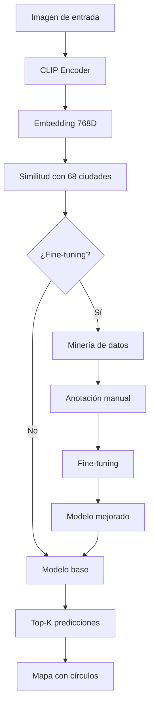

# 🛰️ Geolocalization-OSINT

Sistema de geolocalización inteligente para imágenes de México usando CLIP + OCR con capacidad de fine-tuning.

## 📋 Descripción

Aplicación OSINT que predice la ubicación probable de una imagen dentro de México utilizando:
- **CLIP (ViT-Large)** para análisis visual
- **OCR (Tesseract)** para detección de texto en imágenes
- **Fine-tuning** con datos anotados manualmente para mejorar precisión

## 🚀 Inicio Rápido

### 1. Instalación

```powershell
# Clonar repositorio
git clone https://github.com/EGarpxMaster/Geolocalization-OSINT.git
cd Geolocalization-OSINT

# Crear entorno virtual
python -m venv .venv
.\.venv\Scripts\activate

# Instalar dependencias
pip install -r requirements.txt
```

### 2. Generar Modelo Base

```powershell
python build_model.py
```

Esto generará `model/modelo.pth` con embeddings de 68 ciudades mexicanas.

### 3. Ejecutar Aplicación

```powershell
streamlit run Geolocalizador.py
```

La aplicación estará disponible en `http://localhost:8501`

---

## 🎯 Fine-Tuning para Mejorar Precisión

Si obtienes predicciones con baja confianza (ej: 1-2%), puedes mejorar el modelo con fine-tuning:

### Paso 1: Minería de Datos (100% Gratuito y Open Source)

Descarga imágenes geolocalizadas usando fuentes gratuitas:

```powershell
# Instalar dependencias (si no lo has hecho)
pip install beautifulsoup4 lxml

# (Opcional) Configurar Pexels API gratuita
# Registro gratis en: https://www.pexels.com/api/
$env:PEXELS_API_KEY = "tu_key_gratis"

# Descargar imágenes para todas las ciudades (5 por fuente)
python data_mining.py --mode all --images 5

# O solo para una ciudad específica
python data_mining.py --mode city --city "Puebla" --images 10

# Ver estadísticas
python data_mining.py --mode stats
```

**Fuentes 100% Gratuitas:**
- ✅ **Wikimedia Commons** - Sin límites, open source
- ✅ **Pexels** - API gratuita (requiere registro gratis en 2 minutos)
- ✅ **Google Static Maps** - 28,000 llamadas/mes gratis

**Alternativa: Importar Tus Propias Imágenes**

Si tienes fotos propias o descargadas manualmente:

```powershell
# Importar una imagen
python manual_image_import.py --file "mi_foto.jpg" --city "Puebla"

# Importar carpeta completa
python manual_image_import.py --folder "mis_fotos/guanajuato" --city "Guanajuato"
```

Las imágenes se guardan en `data/mining/images/`

### Paso 2: Anotación Manual

Categoriza las imágenes descargadas manualmente:

```powershell
streamlit run annotation_tool.py
```

**Interfaz de anotación:**
- ✅ Verifica si la imagen corresponde a la ciudad indicada
- 🔧 Corrige la ubicación si es incorrecta
- ⭐ Evalúa calidad de la imagen (Muy baja → Muy alta)
- 🏷️ Marca elementos visibles (landmarks, arquitectura, letreros, etc.)
- 💯 Indica tu confianza en la anotación (0-100%)

**Recomendaciones:**
- Anotar mínimo **50-100 imágenes** para ver mejoras significativas
- Priorizar imágenes de **alta calidad** con elementos característicos
- Ser consistente en los criterios de anotación

### Paso 3: Entrenar Modelo

Ejecuta el fine-tuning con las anotaciones:

```powershell
# Fine-tuning básico (5 épocas)
python finetune_model.py

# Configuración personalizada
python finetune_model.py `
  --epochs 10 `
  --batch-size 16 `
  --lr 1e-5 `
  --min-quality "Alta" `
  --min-confidence 80
```

**Parámetros:**
- `--epochs`: Número de épocas (default: 5)
- `--batch-size`: Tamaño del batch (default: 8, aumentar si tienes GPU)
- `--lr`: Learning rate (default: 1e-5)
- `--min-quality`: Calidad mínima de imágenes a usar
- `--min-confidence`: Confianza mínima del anotador (0-100)
- `--val-split`: Proporción para validación (default: 0.15)

**Salidas:**
- `model/checkpoints/best_model.pth`: Mejor modelo durante entrenamiento
- `model/modelo_finetuned.pth`: Modelo final fine-tuneado

### Paso 4: Regenerar Embeddings

Actualiza los embeddings de ciudades con el modelo fine-tuneado:

```powershell
# Edita build_model.py y cambia la línea del modelo:
# MODEL_NAME = "openai/clip-vit-large-patch14"
# Por:
# MODEL_PATH = "model/modelo_finetuned.pth"

# Luego regenera:
python build_model.py
```

### Paso 5: Probar Modelo Mejorado

```powershell
streamlit run Geolocalizador.py
```

Deberías ver **mayor confianza** en las predicciones (ej: 15-30% vs 1-2%).

---

## 📊 Estructura del Proyecto

```
Geolocalization-OSINT/
│
├── Geolocalizador.py          # App Streamlit principal
├── build_model.py             # Genera embeddings de ciudades
├── data_mining.py             # Minería de imágenes
├── annotation_tool.py         # Herramienta de anotación
├── finetune_model.py          # Fine-tuning del modelo
├── requirements.txt           # Dependencias
│
├── data/
│   ├── cities_mx.csv         # 68 ciudades con coordenadas
│   └── mining/               # Datos de minería
│       ├── images/           # Imágenes descargadas
│       ├── metadata.json     # Metadatos de imágenes
│       └── annotations.json  # Anotaciones manuales
│
├── model/
│   ├── modelo.pth            # Modelo base
│   ├── modelo_finetuned.pth  # Modelo fine-tuneado
│   └── checkpoints/          # Checkpoints de entrenamiento
│
└── photos/                   # Imágenes de prueba
```

---

## 🎛️ Parámetros de la Aplicación

Ajustables desde la barra lateral:

| Parámetro | Descripción | Rango | Default |
|-----------|-------------|-------|---------|
| **Top-K** | Ciudades a mostrar | 1-10 | 3 |
| **Temperatura** | Suaviza/agudiza probabilidades | 0.1-2.0 | 0.7 |
| **Área base** | Tamaño del círculo de incertidumbre | 10-300 km² | 60 km² |
| **State backoff** | Peso del embedding del estado | 0.0-1.0 | 0.25 |
| **OCR city boost** | Bonus por nombre de ciudad en OCR | 0.0-0.5 | 0.15 |
| **OCR state boost** | Bonus por nombre de estado en OCR | 0.0-0.5 | 0.05 |

---

## 🔬 Tecnologías Utilizadas

**Machine Learning:**
- [CLIP (ViT-Large/14)](https://github.com/openai/CLIP) - OpenAI
- PyTorch
- Transformers (HuggingFace)

**OCR:**
- Tesseract OCR
- OpenCV (preprocesamiento)

**Visualización:**
- Streamlit
- Folium (mapas Leaflet)

**Fuentes de Datos (Open Source):**
- Wikimedia Commons API
- Pexels API (gratuita)
- Google Static Maps API
- BeautifulSoup para web scraping ético

---

## 📈 Mejorando Resultados

### Si las predicciones tienen baja confianza:

1. **Aumenta el dataset de fine-tuning**
   - Anota más imágenes (objetivo: 100-500+)
   - Prioriza ciudades con baja precisión

2. **Ajusta parámetros de entrenamiento**
   - Aumenta épocas (10-20)
   - Reduce learning rate (5e-6)
   - Usa solo imágenes de alta calidad

3. **Optimiza parámetros de inferencia**
   - Reduce temperatura (0.3-0.5) para mayor confianza en top-1
   - Ajusta state backoff según resultados

4. **Enriquece el dataset de ciudades**
   - Añade más tags específicos en `cities_mx.csv`
   - Aumenta variedad de prompts en `build_model.py`

### Métricas de éxito:

| Métrica | Modelo base | Después de fine-tuning |
|---------|-------------|------------------------|
| Top-1 prob | 1-5% | 15-40% |
| Top-3 prob | 5-15% | 40-70% |
| Precisión | ~20-30% | ~50-70% |

---

## 🛠️ Requisitos del Sistema

- **Python:** 3.8+
- **RAM:** 8 GB mínimo (16 GB recomendado)
- **GPU:** Opcional pero recomendada para fine-tuning
- **Tesseract:** Requerido para OCR
  - Windows: https://github.com/UB-Mannheim/tesseract/wiki
  - Ruta default: `C:\Program Files\Tesseract-OCR`

---

## 📝 Notas Adicionales

### Instalación de Tesseract (Windows)

```powershell
# Descargar e instalar desde:
# https://github.com/UB-Mannheim/tesseract/wiki

# Verificar instalación
tesseract --version
```

### Uso con GPU

El fine-tuning detecta automáticamente CUDA. Para verificar:

```python
import torch
print(torch.cuda.is_available())  # Debe retornar True
```

### Dataset de Ciudades

El archivo `cities_mx.csv` incluye:
- 68 ciudades principales de México
- Coordenadas GPS (lat, lon)
- Tags (beach, colonial, skyline, etc.)

Para agregar ciudades:

```csv
name,state,lat,lon,tags
Guanajuato,Guanajuato,21.019,-101.257,colonial|mountains
```

---

## 🤝 Contribuciones

Las contribuciones son bienvenidas:

1. Fork el proyecto
2. Crea una rama (`git checkout -b feature/mejora`)
3. Commit cambios (`git commit -m 'Agrega nueva característica'`)
4. Push a la rama (`git push origin feature/mejora`)
5. Abre un Pull Request

---

## 📄 Licencia

Este proyecto es de código abierto y está disponible bajo la licencia MIT.

---

## 🙏 Agradecimientos

- OpenAI por CLIP
- HuggingFace por Transformers
- Tesseract OCR Team
- Flickr y Unsplash por sus APIs

---

## 📧 Contacto

**Autor:** EGarpxMaster  
**Repositorio:** https://github.com/EGarpxMaster/Geolocalization-OSINT

---

## 🔄 Workflow Completo



---

**¡Listo para mejorar la precisión de geolocalización con fine-tuning! 🚀**
